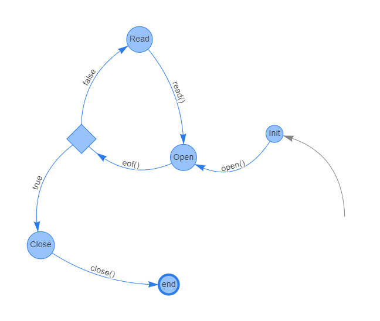

# On using object-oriented tools to check object usage

Typestates are a notion of behavioral types that describe a protocol for stateful objects, specifying the available methods for each state. Usually, objects with protocols are either forced to be used in a linear way, which restricts what a programmer can do, or deductive verification is required to verify programs where these objects may be aliased.

In this set of examples, we present implementations of file readers, with usage protocols, linked-lists, iterators, and use cases of these kinds of objects.

The purpose of these examples is to evaluate if it is possible to statically guarantee protocol compliance, as well as protocol completion, even when the file readers are shared in linked-lists, and evaluate the programmer's effort in making the code acceptable to object-oriented static verification tools.

A detailed analysis of VeriFast, VerCors, Plural, and KeY, is available on arXiv: [https://arxiv.org/abs/2209.05136](https://arxiv.org/abs/2209.05136).

This work is licensed under a
[Creative Commons Attribution 4.0 International License](https://creativecommons.org/licenses/by/4.0/).

## File Reader protocol



Image generated with the [Typestate Editor](https://typestate-editor.github.io/).

Corresponding Mungo protocol:

```java
typestate FileProtocol {
  Init = {
    void open(): Open
  }
  Open = {
    boolean eof(): <true: Close, false: Read>
  }
  Read = {
    byte read(): Open
  }
  Close = {
    void close(): end
  }
}
```
